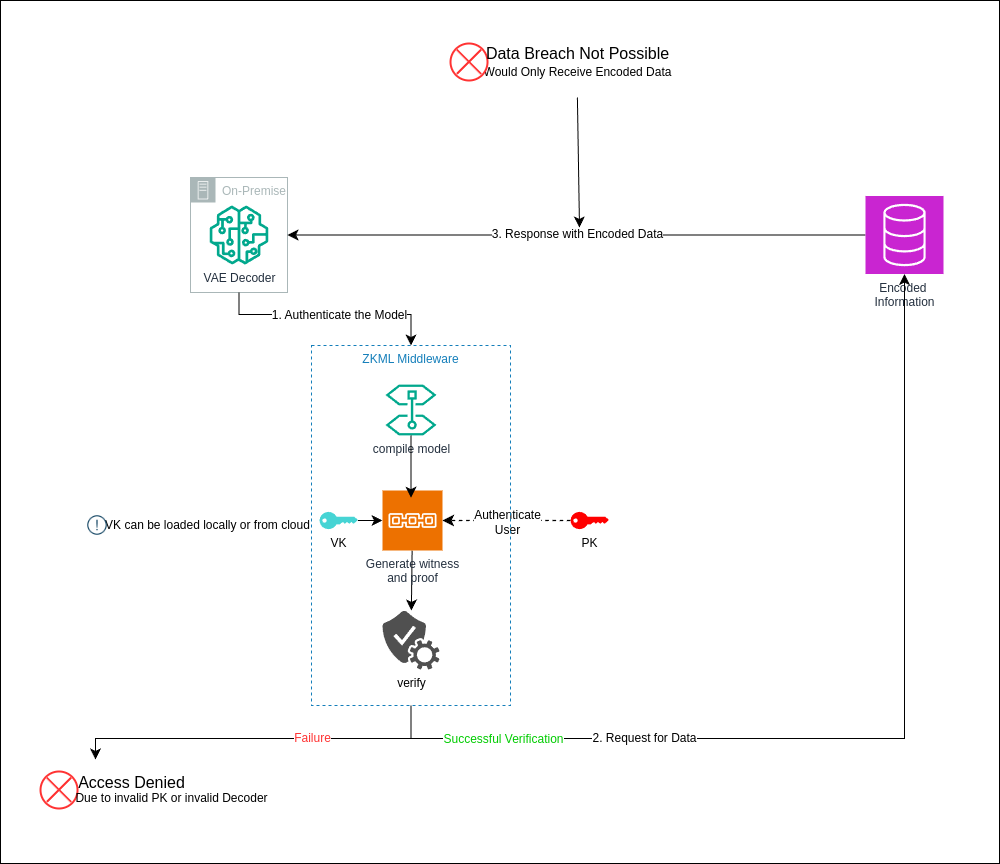

# Ziphr
Securing confidential data in a database using a ZKML-based cryptographic approach with auto-encoder-based encoding



## Working
1. The confidential data is encoded using Seq2Seq model
2. The decoder of the model is loaded on the on-premise software. 
3. ZKML is used to generate a compiled model from the decoder model which is used to generate proof using the prover mechanism. The provers generate a ZK proof. The proof is generated such that the weights of the model are hashed + zk-hashed with the encoded inputs zk-hashed in the proof with the help of a proving key generated in the setup phase. 
4. When the verifier receives the proof, it tries to impose challenges with a verification key generated in the setup phase. If the weights of the model are authentic and the proof is generated with the true proving key, in that case, it responds with the encoded data from the database. The verifier is hosted as an edge function in the database.
5. Finally, the client receives the encoded data decoded using the on-premise model. The secure system ensures that the receiver has to use the right model with a true proving key.

## Local Setup
Clone the repository and install the required packages using poetry and follow the below steps:

1. Setup ZKML using ezkl:
```bash
python zkml/setup/ezkl_setup.py 
```

2. Run Client (Streamlit):
```bash
streamlit run main.py
```

3. Run Verifier Server (FastAPI):
```bash
# Run the verifier server on cloud
uvicorn verifier:app --reload

# Note: Run the below command for developer mode
fastapi dev zkml/verifier/verifier.py
```

